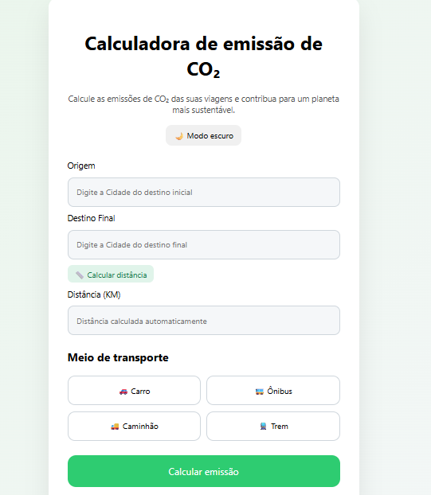

<div align="center">

# Calculadora de Emissão de CO₂ 🌱


</div>


## Descrição do Projeto

Este projeto consiste em uma Calculadora de Emissão de CO₂, desenvolvida para estimar a quantidade de dióxido de carbono emitida em viagens terrestres, de acordo com a distância percorrida e o meio de transporte utilizado.

A aplicação foi construída utilizando Node.js no backend e HTML, CSS e JavaScript no frontend, com integração de APIs externas para cálculo de distância real entre cidades e geração de dicas sustentáveis com inteligência artificial.

O projeto está completo e pronto para uso, porém, para que todas as funcionalidades funcionem corretamente, é necessário substituir as chaves de API de exemplo pelas suas próprias chaves.

🔑 OpenRouteService
A chave é criada gratuitamente em:
https://openrouteservice.org

A criação dessa chave é essencial para que o sistema consiga calcular a distância automaticamente entre cidades.

Essa API é utilizada para gerar dicas sustentáveis com inteligência artificial.

---

## Funcionalidades do Projeto

- Inserção da cidade de origem e destino.
- Cálculo automático da distância real entre cidades
- Seleção do meio de transporte:
  - Carro
  - Ônibus
  - Caminhão
  - Trem
- Cálculo da emissão estimada de CO₂
- Geração de dicas sustentáveis com auxílio da API do ChatGPT
- Interface moderna com modo claro e modo escuro

--- 

## Testes de Software

### ▪️ Teste de Depuração

- ✓  Verificação de erros no console do navegador e no terminal do Node.js
- ✓  Validação de respostas das APIs externas

### ▪️ Teste de Funcionamento

- ✓  Teste do cálculo de distância entre diferentes cidades 
- ✓  Teste do cálculo de emissão de CO₂ para todos os meios de transporte
- ✓  Teste da alternância entre modo claro e modo escuro

<div align="center">
  
  <p><i>Imagem do teste</i></p>
</div>


### ▪️ Teste de Segurança

- ✓  Uso de variáveis de ambiente (.env) para proteger chaves de API
- ✓  Arquivo `.env` incluído no `.gitignore`

---

## Tecnologias e Linguagens


---

## Bibliotecas e Frameworks

 — Criação do servidor backend

 — Consumo da API OpenRouteService

 — Integração com a API do ChatGPT

---

## Pré-requisitos e Instalação

### ▪️ Pré-requisitos

- Node.js instalado  
- Navegador web moderno

### ▪️ Instalação

**1.** Acesse a pasta backend
```bash
cd backend
```

**2.** Instale as dependências
```bash
npm install
```

**3.** Configure o arquivo `.env` com suas chaves de API
```env
OPENROUTE_API_KEY=sua_chave_aqui
OPENAI_API_KEY=sua_chave_aqui
```

**4.** Inicie o servidor
```bash
node server.js
```

**5.** Abra o arquivo `frontend/index.html` no navegador


## ▪️ Instruções de Uso

**1.** Abra o projeto no navegador  
**2.** Informe a cidade de origem e destino  
**3.** Clique em **"Calcular distância"**  
**4.** Escolha o meio de transporte  
**5.** Clique em **"Calcular emissão"**  
**6.** Visualize o resultado e a dica sustentável gerada pela IA

---

## Documentação Oficial:

-  — https://developer.mozilla.org/pt-BR/docs/Web/JavaScript

-  — https://developer.mozilla.org/pt-BR/docs/Web/HTML

-  — https://developer.mozilla.org/pt-BR/docs/Web/CSS

-  — https://docs.github.com/pt/copilot

-  — https://code.visualstudio.com/docs

-  — https://git-scm.com/doc

-  — https://nodejs.org

-  — https://expressjs.com

-  — https://platform.openai.com

-  — https://openrouteservice.org


---

<div align="center">

###  Desenvolvido com propósito 

*Projeto educacional focado em sustentabilidade e boas práticas de desenvolvimento 👩🏻‍💻🌱*

*Feito com 💚 para um futuro mais verde*

</div>
